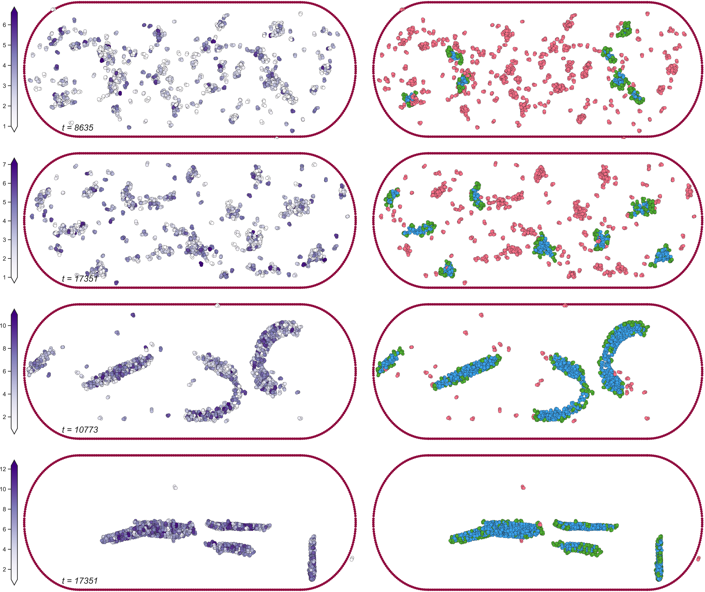

   

# Residence Paper Codes

## **Codes for the Residence Behavior Analyis and Plotting**

### ***Preprocessing***

**0_dataBuild**\
**1_dataProcessing**

### ***Data Analysis and Figures***

Saved to Figures Folder
*Note: Fig1 was direcly created in Illustrator*

#### *Following links leads to source code necessary to build the named figures...*

**2_residenceAnalysis** 

* [Fig2A](2_residenceAnalysis/fullresidence_scatters.py)
* [Fig2B](2_residenceAnalysis/residuals_boxplot.py)
* [SI-Fig1](2_residenceAnalysis/fullresidence_scatters.py)

**3_systemVisualize**  

* [Fig3](3_systemVisualize/system_visualize.py)

**4_clusterDiffuse**

* [Fig4](4_clusterDiffuse/diffuse_analysis.py)
* [Fig5](4_clusterDiffuse/surface_analysis.py)
* [SI-Fig2](4_clusterDiffuse/surface_visualize.py)

**5_distributedAffinity** 

* [Fig6](5_distributedAffinity/distributed_affinity.py)
